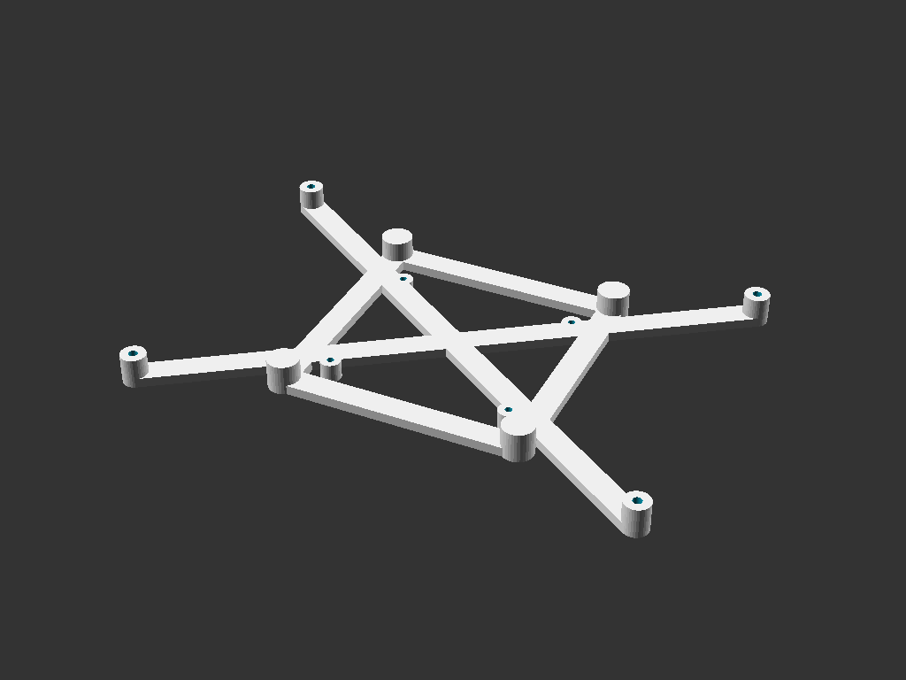

# adafruit_hdmi_backpack_vesa_adapter
Adapter to hold an Adafruit HDMI Display Backpack and a Raspberry Pi together on a standard vesa mount.  
Supports both 7 inch and 5 inch models, with and without touch.  
Supports Vesa75 and Vesa100.  
Supports Raspberry Pi 4, 3B+, and whatever other models have the same bolt pattern.

 This work is licensed under a <a rel="license" href="http://creativecommons.org/licenses/by-sa/4.0/">Creative Commons Attribution-ShareAlike 4.0 International License</a>.
